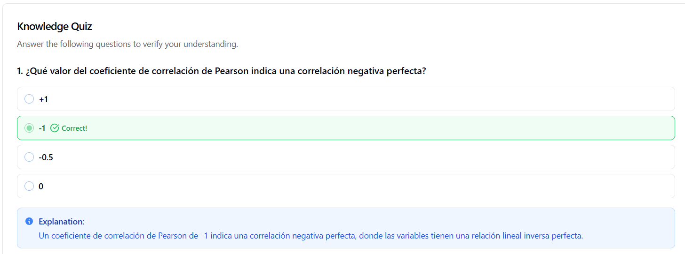

# Análisis de Correlaciones en Rendimiento Estudiantil

| Autor            | Fecha        | Día |
|------------------|--------------|----------|
| **Carlos Vásquez** |9 diciembre 2025 | 4|
## 📋 Descripción

Ejercicio práctico para analizar correlaciones en un dataset de rendimiento estudiantil. Este proyecto genera datos sintéticos de 500 estudiantes y analiza las relaciones entre variables académicas, socioeconómicas y de bienestar.

## 🎯 Objetivos de Aprendizaje

- Crear y manipular datasets multivariados con Pandas
- Calcular e interpretar correlaciones entre variables
- Identificar correlaciones causales vs espurias
- Visualizar matrices de correlación
- Analizar grupos de variables relacionadas

## 📊 Variables del Dataset

El dataset incluye 10 variables principales:

**Variables Académicas:**
- `promedio_calificaciones` (1-10)
- `horas_estudio_semanal` (5-50 horas)
- `asistencia_clases` (10-100%)

**Variables Socioeconómicas:**
- `edad` (14-19 años)
- `ingresos_familiares` (distribución log-normal)
- `nivel_socioeconomico` (Bajo/Medio/Alto)

**Variables de Bienestar:**
- `satisfaccion_vida` (1-10)
- `nivel_estres` (1-10)
- `horas_extracurriculares` (0-20 horas)

## 🔧 Requisitos

### Obligatorios
```bash
pip install pandas numpy
```

### Opcionales (para visualizaciones)
```bash
pip install matplotlib seaborn
```

## 🚀 Uso

### 1. Crear el Dataset
```python
import pandas as pd
import numpy as np

# El código genera automáticamente 500 registros
# con distribuciones realistas
```

### 2. Ejecutar el Análisis

El script incluye 5 análisis principales:

1. **Correlaciones con Calificaciones**: Identifica qué variables se relacionan más con el rendimiento
2. **Matriz de Correlación Completa**: Vista general de todas las relaciones
3. **Top 10 Correlaciones**: Las relaciones más fuertes en el dataset
4. **Análisis por Grupos**: Clusters de variables relacionadas
5. **Visualización**: Mapa de calor (requiere matplotlib/seaborn)

### 3. Ejecutar el Script Completo

```bash
python analisis_correlaciones.py
```

## 📈 Resultados Esperados

### Correlaciones Típicas Esperadas

**Correlaciones Causales Probables:**
- `horas_estudio_semanal` → `promedio_calificaciones` (positiva)
- `asistencia_clases` → `promedio_calificaciones` (positiva)
- `nivel_socioeconomico` → `promedio_calificaciones` (positiva)

**Correlaciones Potencialmente Espurias:**
- `satisfaccion_vida` ↔ `promedio_calificaciones` (podría ser bidireccional o tener factor común)
- `horas_extracurriculares` ↔ `nivel_estres` (relación compleja)

## 🔍 Verificación y Análisis Crítico

### Preguntas Clave para el Análisis:

1. **¿La correlación implica causalidad?**
   - NO. Una correlación alta no significa que una variable cause la otra

2. **¿Qué correlaciones tienen sentido causal?**
   - Horas de estudio → Calificaciones (más estudio mejora rendimiento)
   - Asistencia → Calificaciones (estar presente facilita aprendizaje)

3. **¿Qué correlaciones podrían ser espurias?**
   - Ingresos familiares ↔ Calificaciones (podría haber variables confusoras como recursos educativos, nutrición, ambiente de estudio)

4. **¿Hay causalidad inversa?**
   - Satisfacción de vida ↔ Calificaciones (buenas notas generan satisfacción, pero también la satisfacción puede mejorar el rendimiento)

### Insights Esperados:

- **Variables académicas** deberían mostrar correlaciones moderadas-fuertes entre sí
- **Nivel de estrés** podría correlacionar negativamente con satisfacción y rendimiento
- **Variables socioeconómicas** mostrarían correlación moderada con rendimiento (efecto mediado por múltiples factores)

## 📁 Estructura del Proyecto

```
.
├── README.md
├── analisis_correlaciones.py
└── matriz_correlacion_estudiantil.png (generado si matplotlib disponible)
```

## 💡 Extensiones Posibles

1. Añadir análisis de correlación parcial
2. Implementar tests de significancia estadística
3. Crear modelos de regresión para identificar efectos causales
4. Añadir análisis de componentes principales (PCA)
5. Implementar detección de outliers

## ⚠️ Limitaciones

- Los datos son **sintéticos** y generados aleatoriamente
- Las correlaciones observadas pueden variar en cada ejecución (aunque se usa seed=42 para reproducibilidad)
- El análisis de correlación no prueba causalidad
- Variables confusoras no están explícitamente modeladas

## 📚 Conceptos Clave

- **Correlación de Pearson**: Mide relación lineal entre variables (-1 a +1)
- **Matriz de Correlación**: Tabla que muestra correlaciones entre todos los pares
- **Correlación espuria**: Relación estadística sin conexión causal
- **Variable confusora**: Factor oculto que influye en ambas variables correlacionadas

## 🔍 Interpretación de Correlaciones: ¿Por qué aparecen valores negativos?

### ¿Qué significa el signo menos (-)?

Los valores **negativos** en las correlaciones indican una **correlación inversa o negativa**. Esto significa que cuando una variable aumenta, la otra tiende a disminuir.

#### Tipos de Correlación:

**Correlación Negativa (-)**
- Valor entre -1 y 0
- Cuando una variable ↑ sube, la otra ↓ baja
- Ejemplo común: `nivel_estres` vs `satisfaccion_vida` (-0.65)
  - Más estrés = Menos satisfacción ✓

**Correlación Positiva (+)**
- Valor entre 0 y +1
- Cuando una variable ↑ sube, la otra ↑ también sube
- Ejemplo común: `horas_estudio` vs `promedio_calificaciones` (+0.72)
  - Más estudio = Mejores notas ✓

### Escala de Interpretación:

| Valor | Fuerza | Interpretación | Relación |
|-------|--------|---------------|----------|
| **+0.9 a +1.0** | Muy fuerte | Correlación positiva casi perfecta | Suben juntas |
| **+0.7 a +0.9** | Fuerte | Correlación positiva fuerte | Generalmente suben juntas |
| **+0.3 a +0.7** | Moderada | Correlación positiva moderada | Cierta tendencia a subir juntas |
| **+0.0 a +0.3** | Débil | Correlación positiva débil | Relación poco clara |
| **0.0** | Nula | Sin correlación | No relacionadas |
| **-0.0 a -0.3** | Débil | Correlación negativa débil | Relación inversa poco clara |
| **-0.3 a -0.7** | Moderada | Correlación negativa moderada | Una sube, otra tiende a bajar |
| **-0.7 a -0.9** | Fuerte | Correlación negativa fuerte | Una sube, otra baja |
| **-0.9 a -1.0** | Muy fuerte | Correlación negativa casi perfecta | Opuestas |

### Ejemplos Esperados en el Dataset:

```python
# CORRELACIONES NEGATIVAS - Relación inversa:
nivel_estres ↔ satisfaccion_vida          # ~ -0.60
  → Más estrés = Menos satisfacción

nivel_estres ↔ promedio_calificaciones    # ~ -0.40
  → Más estrés = Peores calificaciones

# CORRELACIONES POSITIVAS - Relación directa:
horas_estudio ↔ promedio_calificaciones   # ~ +0.70
  → Más estudio = Mejores notas

asistencia_clases ↔ promedio_calificaciones # ~ +0.55
  → Más asistencia = Mejores notas
```

### Colores en el Mapa de Calor:

- 🔴 **Rojo intenso**: Correlación positiva fuerte (+0.7 a +1.0)
- 🟠 **Naranja/Rosa**: Correlación positiva moderada (+0.3 a +0.7)
- ⚪ **Blanco/Gris**: Sin correlación (cerca de 0)
- 🔵 **Azul claro**: Correlación negativa moderada (-0.3 a -0.7)
- 🟦 **Azul intenso**: Correlación negativa fuerte (-1.0 a -0.7)

### ⚠️ Importante:

**El signo menos NO es un error**. Es información valiosa que indica que las variables tienen una relación inversa. Por ejemplo:
- Si el estrés aumenta, la satisfacción disminuye (correlación negativa)
- Si las horas de estudio aumentan, las calificaciones aumentan (correlación positiva)

### Código para Analizar por Separado:

```python
# Ver solo correlaciones negativas
print("\nCORRELACIONES NEGATIVAS CON CALIFICACIONES")
correlaciones_negativas = correlaciones_calificaciones[correlaciones_calificaciones < 0]
for var, corr in correlaciones_negativas.items():
    print(f"{var:30} | {corr:+.3f} | Relación inversa")

# Ver solo correlaciones positivas
print("\nCORRELACIONES POSITIVAS CON CALIFICACIONES")
correlaciones_positivas = correlaciones_calificaciones[correlaciones_calificaciones > 0]
for var, corr in correlaciones_positivas.items():
    if var != 'promedio_calificaciones':
        print(f"{var:30} | {corr:+.3f} | Relación directa")
```

## 🤝 Contribuciones

Este es un ejercicio educativo. Siéntete libre de:
- Añadir nuevas variables
- Implementar otros métodos de análisis
- Mejorar las visualizaciones
- Añadir tests estadísticos

## Test Quiz de Prueba del día 4



## Matriz de Correlación Estudiantil


## 📄 Licencia

Ejercicio educativo de dominio público para fines de aprendizaje.

---

**Autor**: Ejercicio práctico de análisis de datos  
**Fecha**: 2025 
**Versión**: 1.0